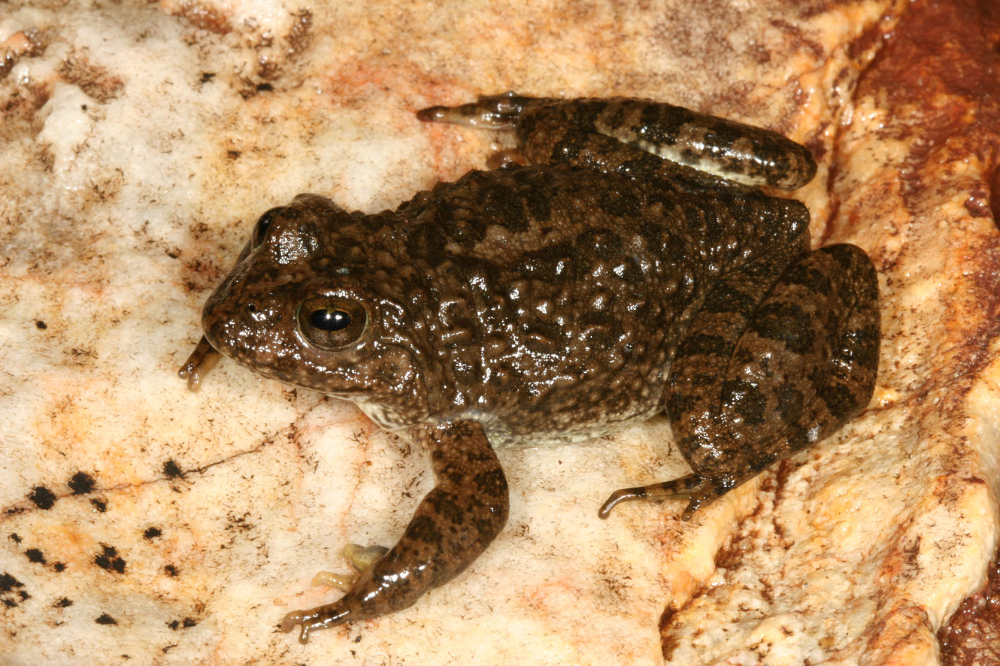

```{r setup, include=FALSE}
knitr::opts_chunk$set(echo = TRUE)
```

# INTRODUCTION 
In this course, we'll learn how to: 
<br>

```
* Process raw Illumina sequencing reads of 16S amplicon data, including data QC, and sequence variant calling 
* Quantify traits of microbial community structure, including metrics of alpha diversity and beta diversity
* Fit models to microbial community data to examine how community structure may covary with host life history traits of interest
* Report statistics derived from these analyses in manuscripts 
* Make and export some appealing visualisations of microbial communities and how they differ between treatments / host traits. 
```
  <br>
  

## Data and Study Species 
We're going to be looking at a dataset of skin bacterial communities, sampled from wild Phofung River frog (_Amietia hymenopus_) tadpoles in the Drakensberg mountains, South Africa. We have data from _29 individuals from two sites_.

We have been tasked with i) characterising the skin microbiome diversity/composition of this species, and ii) looking for systematic associations between skin microbiome and infection with the lethal fungal pathogen _Batrachochytrium dendrobatidis_ (Bd). 

<br>


<center>

{width=600px}

</center>

We have been given the raw sequencing files of the v4 region of the 16S rRNA gene from a paired-end 300bp sequencing run on the Illumina Miseq (V3 Chemistry). 

There's also a no-template negative control, and a mock community.   
<br>
The __no-template control__ allows us to quantify background levels of contamination in the sequencing run, including bacterial contamination in the reagents referred to as the 'kitome' Fun fact! Every reagent / DNA extraction kit / PCR mastermix / sequencing cartridge will have some contamination in it, and different batches of the same reagent can often have unique microbiome profiles! See the [blog](http://blog.mothur.org/2014/11/12/TheKitome/) by Pat Schloss and [paper](https://bmcbiol.biomedcentral.com/articles/10.1186/s12915-014-0087-z)  
  
The __mock community__ is a uniquely barcoded sample containing an artificially-created community of bacteria with known (often full length) 16S sequence data. Sequencing this community alongside our samples allows us to assess whether i) our estimated number of unique sequences (roughly corresponding to dataset-level alpha diversity) is correct; and ii) whether the actual sequences themselves are correct or contain errors. You can imagine you could have a correct estimate of the unique number of sequences, but the sequences themselves might be very error-prone. Or your run may have recovered the correct sequences but also generated a lot of noise, inflating the total number of seqs in the data set. By estimating these two quantities, we can be confident than any actual alpha & beta diversity differences among samples are real and not artefacts generated by the messy sequencing. It is vital that you always include a mock community in your library preps. 


We'll tackle these data in two sections:

Part 1 (this section) will deal with the raw-read processing and bioinformatics. Part 2  will deal with statistics and analyses. 


# PART 1 BIOINFORMATICS

## Libraries
These are the libraries we will need for this workflow.
```{r}

#Calling of Amplicon Sequence Variants (ASVs)
    library(dada2)
    packageVersion('dada2')  
  
#Accessory Packages
  #library(ips) # tree building
  library(ape) # more trees
  library(openssl) #reproducible sequence naming 
  
#Downstream Statistics
  library(phyloseq)

```


## File Path and Data 
Now we need to tell DADA2 where to look for the data files, using the 'set path command'. The path below will need to be changed to the folder where you stored your copy of the training data. The nice thing about R Studio is that you can use 'Tab Complete' to navigate to your folder. 

<p style="color:red">*YOU WILL NEED TO CHANGE THIS FILE PATH*</p>


```{r}

  
  #Specify File Path
    path <- "~/Desktop/MSc Pathogen Evolution Bioinformatics/" # CHANGE ME to the directory containing the fastq files after unzipping.
    list.files(path)
```

This should show you a long list of all the files. Now we'll extract the file names and sort them so that paired F and R reads for the same sample occur in the same order. 
  
  
Then we'll use a function that can strip the sample names out of the read names from the instrument. These are important because they will be used to match up the sequencing reads to our sample metadata later. 

```{r}
  ## Forward and reverse fastq filenames 
    fnFs <- sort(list.files(path, pattern="_R1_001_cuta.fastq", full.names = TRUE))
    fnRs <- sort(list.files(path, pattern="_R2_001_cuta.fastq", full.names = TRUE))
    
  # Extract sample names, 2nd element of name
      #have to add extra string here to prevent duplicate names
    sample.names <- paste(sapply(strsplit(basename(fnFs), "_"), `[`, 2),sapply(strsplit(basename(fnFs), "_"), `[`, 4),sep="_")
                      
    #Scrub Trailing R1
      sample.names2<- gsub("_R1$","",sample.names)
      
    #Check for Duplicates
      sample.names[which(duplicated(sample.names))]
      fnFs[which(duplicated(sample.names))]
```


## Quality Profiles

Now that we've done all the file admin, we can use some of the built in functions in DADA2 to inspect our raw data to assess the quality of the sequencing data. 
  
  Just run the first line of code. This will show you the first two samples of the FORWARD reads from the MiSeq. The x axis is the sequencing cycle number, which maxes out at 250 because this was a 250bp PE v2 chemistry run. The y axis is the Quality Score, which is a measure of sequencing accuracy / certainty. The higher the Q score, the lower the proabability of a sequencing error having occurred. Generally Q scores >30 are desirable. More info on Q scores can be found [here](https://www.illumina.com/science/technology/next-generation-sequencing/plan-experiments/quality-scores.html). In the bottom corner it will also tell you how many reads there are per sample. 

### Forward Read
```{r}
  #Quality Profiles
    plotQualityProfile(fnFs[3:4]) #Forwards reasonable, suggest trim 275 to start with (~Q27), 250 for Q30
```

### Reverse Reads
```{r}
    plotQualityProfile(fnRs[3:4]) #Worse as expected, 250bp = Q25, 200bp for Q30
    
```

## Filter and Trim 
So the step before where we inspect quality profiles is really important. This is because there can be huge run to run variation in sequencing performance, and so the quality of reads along the 250bp read might decline at different rates for each run for the SAME read direction. We might also expect the difference in performance for F and R reads to differ too. 
  
  
What do we do with these data? We can use our inspection of raw read qualities to make decisions about i) trimming the reads to get rid of low quality sequences at the ends of the reads and ii) filter some reads out that fail to meet a certain minimum quality  
<br>

First, we set up some folders that will act as a home to our filtered and trimmed reads:
```{r}

######## FILTER AND TRIM 
    
  # Place filtered files in filtered/ subdirectory
    filtFs <- file.path(path, "filtered", paste0(sample.names, "_F_filt.fastq.gz"))
    filtRs <- file.path(path, "filtered", paste0(sample.names, "_R_filt.fastq.gz"))
    names(filtFs) <- sample.names2
    names(filtRs) <- sample.names2
```

Next, we filter and trim the reads based on some quality rules. The following is a very important bit of code, and will take a while to run.

The first 4 arguments __(fnFs, filtFs, fnRs, filtRs)__ contain the paths to read files in [fnFs,fnRs] and where to store the filtered results [filtFs,filtRs] that we just created. 

__truncLen__ : is a 2 item vector that says where to _trim_ the F and R reads. The default is to trim only the last 10 bases from the forwards, and 90 bases from the reverse reads. Go back and check the quality profiles again and see if you think this is reasonable. In the majority of cases these 'default' values will just be fine, but don't apply them blindly, and don't be afraid to adjust them for your own data. If your R reads are stellar, then feel free not to chop as much off the back end. Just remember to always ensure that the trunc values you specify will _still ensure an overlap of reads_ of your amplicon.

__MaxN__ : The total number of uncalled bases 'N's to allow. Default 0, don't change it. 

__maxEE__ : The maximum number of 'expected errors' to allow in a read, allowing you to specify separate values for c(F,R) reads. This is an alternative to simply filtering based on average Q score of the read, which can be problematic if it's skewed by a few high quality basecalls that mask the junk lurking within. Keeping it at 2 per F and R read for a 250bp amplicon seems reasonable. 

__truncQ__: Truncate reads at the point where a base with this Q score is encountered. Default 2. 

There's a [plethora of options](https://rdrr.io/bioc/dada2/man/filterAndTrim.html) you can tweak with this function, if you're interested. Have a look. 

```{r}
  #FILTER AND TRIM
    out <- filterAndTrim(fnFs, filtFs, fnRs, filtRs, truncLen=c(275,200),
    maxN=0, maxEE=c(2,2), truncQ=2, rm.phix=TRUE,
    compress=TRUE, multithread=TRUE,trimLeft = c(20,20)) 
```

DADA2 has now made a nice summary of the how many reads have survived our filtering and trimming step. Have a look:

```{r}
    #Inspect
      head(out)  
      
```

If you wanted, you could play around with the parameters above and see what effect it has on the reads making the cut. If you do, remember to call the new 'out' object something different. So we might decide to be less brutal with our reverse cull. If the first filter_and_trim was very slow on your computer, you might want to rethink running this step. 

```
out_rev220<-filterAndTrim(fnFs, filtFs, fnRs, filtRs, truncLen=c(240,220),
                       maxN=0, maxEE=c(2,2), truncQ=2, rm.phix=TRUE,
                       compress=TRUE, multithread=TRUE) 

```
## Error Rates

Ok, so now we have filtered our data to a quality that we're happy with so to try and minimise sequencing errors. 

The following [taken from the original DADA2 paper][https://pdfs.semanticscholar.org/88b2/f20b82d9432d96832f22ef34abc1ed17526b.pdf] explains the DADA2 approach of learning error rates from the data is so powerful:


>Currently, errors in Illumina-sequenced amplicon data are most often addressed by filter- ing low quality reads and constructing Operational Taxonomic Units (OTUs): clusters of sequences that differ by less than a fixed dissimilarity threshold (typically 3%) within which sequence variation is ignored [9, 10, 11]. Lumping similar sequences together reduces the rate at which errors are misinterpreted as biological variation, but OTUs under-utilize the quality of modern sequencing by precluding the possibility of resolving fine-scale (or strain-level) variation [7, 12, 13, 14, 15].


So DADA2's method of calling 'Amplicon Sequence Variants (ASVs)' differes from Operational Taxonomic Unit (OTU) approaches that cluster sequences to a fixed simialrity threshold (usually 97% similarity) to try and minimise errors. So now we're going to estimate the rates of sequencing error in our data, and use those errors to separate biological signal (real sequences) from noise (residual sequencing errors). DADA2 'denoises' the sequences (DADA = Divsive Amplicon Denoising Algorithm) to give you a dataset of (hopefully) 'exact sequence variants'.

So the following code will estimate per-read error rates, using the first 1,000,000 bases from the samples for that read direction. Run this now. It might take a little while.

```{r,cache=T}
######### ERROR RATES
      errF <- learnErrors(filtFs, multithread=TRUE)
      errR <- learnErrors(filtRs, multithread=TRUE)
      plotErrors(errF, nominalQ=TRUE)
```    


__How does DADA2 estimate error rates?__ The short answer is "it's complicated". But a slightly longer answer is that DADA2 does some fancy modelling to reconstruct expected genotypes, and then assesses two key probability traits to work out whether a sequence in the dataset is real or not. The first looks at the relative abundance of sequences, and broadly accepts sequences that are very high abundance as likely true sequences (i.e. if multiple independent reads have all recovered the same sequence, it's probably real). The second looks at the distance between a sequence under consideration and calculates if it's too far away from other inferred 'true sequences' to be an error. Put another way, a sequence differing by only one base from a true sequence could very well be an error. One differing by 10 bases likely isn't. The model optimises these two traits iteratively until the model converges. Like all elegant mathematics, it looks to be witchcraft on first inspection. 
  
  
You  can [read about the details here](https://www.nature.com/articles/nmeth.3869#methods) if you're interested. 

<br>
Now we can inspect the error profiles. These error rates are the transition probabilities for individual dyads of bases (y axis) by quality score (x axis). As you might expect, the probability of commiting an error declines as the Q score of the base call increases - all the slopes are negative. The diagonals are all flat because the bases aren't changing i.e. A->A. The black line is the error model fitted to the data (black dots, the actual estimates error rate) - we can assess how robust the error rate model is if the black line does a good job of tracking the points. DADA2 uses this model to quantify the likelihood of a particular base call of a given quality score being an error, and will adjust our raw sequences in the next step. 

__YOUR DATA__ Like above, this step uses only a subset of the data. If the error model looks a poor fit (black line does not track data points) you can tell DADA2 to increase the amount of data it uses to learn the error model. 

## Denoising Raw Sequences Using Error Rates

So we have filtered sequence data, and an error model. It's time to infer our 'exact' Amplicon Sequence Variants (ASVs). 

```{r}

######### SAMPLE INFERENCE
      dadaFs <- dada(filtFs, err=errF, multithread=TRUE)
      dadaRs <- dada(filtRs, err=errR, multithread=TRUE)
```

## Merge Denoised F and R pairs into Contigs

Easy peasy! Now our F and R reads have each been denoised using read-specific error models to what we hope is biologically relevant sequence variation!  

The next step is to join F and R denoised, dereplicated reads into contigs of the ~250bp consensus sequence we're actually interested in. Note the contig size here will change dependign on your primer sets and read chemistry (V2/V3 MISeq, 150bp PE NovaSeq etc) for different data

```{r}
######### MERGE ERROR-CORRECTED PAIRED READS
      mergers <- mergePairs(dadaFs, filtFs, dadaRs, filtRs, verbose=TRUE)

```

## Summarise Sequences Across All Samples 

Now we inspect the contigs we've made to look at the distribution of sequence lengths. Rememebr that we're expecting amplicons of around 250bp

```{r}
######### MAKE SEQUENCE TABLE
      seqtab <- makeSequenceTable(mergers)
      dim(seqtab)
      
    #LENGTH DISTRIBUTION 
      table(nchar(getSequences(seqtab)))
```


### Further Filtering Based on Length 
It looks like we've got a lot of sequences at the expected length. (~240-260). But also some sequences that are much longer than expected >300bp and low abundance, some of them singletons.We probably don't want these as they may be the result of non-specific priming at non-target sites (i.e. somewhere that's not the v4 16S amplicon). We can trim these as follows:

Let's ask what PERCENTAGE of reads are over 260, so likely to be junk
```{r}
    #How many over 260 bp?
      sizedist<-data.frame(t(table(nchar(getSequences(seqtab)))))
      filtseqs<-sum(sizedist[,3][which(as.numeric(as.character(sizedist[,2]))>260)])
      (filtseqs/sum(sizedist[,3]) )*100
```

<1%, so we can confidently boot them out. 
      
```{r}
    #Trimming Step?
      seqtab2 <- seqtab[,nchar(colnames(seqtab)) %in% 250:260]
```

## Remove Chimeras

The final step is to identify and remove chimeras. One of the pitfalls of next-gen sequencing that uses sequencing-by-synthesis methods is that there millions of PCRs all occurring simultaneously, and sometimes two real sequences will hybridise to form a novel chimeric sequence that isn't real. As per the DADA2 workflow: "Chimeric sequences are identified if they can be exactly reconstructed by combining a left-segment and a right-segment from two more abundant “parent” sequences.""

Remember that we're using _seqtab2_ here - the trimmed one that removed non-target length sequences. 

```{r}

########### REMOVE CHIMERAS
      set.seed(1000)
      seqtab.nochim <- removeBimeraDenovo(seqtab2, method="consensus", multithread=TRUE, verbose=TRUE)


## How many Chimeras?
      dim(seqtab2)[2]-dim(seqtab.nochim)[2] # ~ 43 bimeras
      
# How Many Reads Did We Retain?
        sum(seqtab.nochim)/sum(seqtab2) #99.2% reads retained
```


## Tracking Reads Through The PipeLine 

DADA2 will tell us how many chimeric sequences it found out of the total. And that's the last step in our quality control for the sequencing portion of the workflow. Now we can generate a handy per-sample summary that tracks reads-per-sample throughout each step we've performed in this workflow. 

```{r}
############# PIPELINE READ TRACKING 
      getN <- function(x) sum(getUniques(x))
      track <- cbind(out, sapply(dadaFs, getN), sapply(dadaRs, getN), sapply(mergers, getN), rowSums(seqtab.nochim))
      # If processing a single sample, remove the sapply calls: e.g. replace sapply(dadaFs, getN) with getN(dadaFs)
      colnames(track) <- c("input", "filtered", "denoisedF", "denoisedR", "merged", "nonchim")
      rownames(track) <- sample.names
      head(track)

```


## Taxonomic Assignment 

Now that we've adjusted our sequences for errors, and removed chimeras, we can assign taxonomy to them. To do this, we need a reference database. The maintainers of DADA2 format some of the most commonly used databases, SILVA and RDP, for use with DADA2. [They are kept here](https://benjjneb.github.io/dada2/training.html)
  
  <br>
We'll use the most recent version of the SILVA database. You'll need to tell DADA2 where to find it. Assigning taxonomy is as easy as the following. But it will take a long time to do for this small subset of a full sequencing run, and even longer for a full run. Feel free to take a break whilst this runs!
  
NOTE: If taxonomic assignment seems poor, it can be useful to compare assignments across databases (e.g. RDP vs SILVA). Again, just create a new R object (e.g. taxa_rdp) and use a different database, allowing comparison of end results. 

### Kingdom to Genus

\textcolor{red}{Remember to change to file path to _your_ 'Taxonomy' folder}

```{r,cache=T}

# Random Number Seed for Reproducibility 
    set.seed(100)

##ASSIGN TAXONOMY
      taxa <- assignTaxonomy(seqtab.nochim, "~/Desktop/MSc Pathogen Evolution Bioinformatics/Taxonomy/silva_nr99_v138.1_train_set.fa", multithread=TRUE)
      head(unname(taxa))
      
```


### Risky Taxonomic Bonus: Species ID

We can also try and assign species-level taxonomy to some sequences. As you might guess, this is very difficult to do from a 250bp sequence of a highly conserved marker gene like 16S rRNA, and many people has a problem with it. But, for very well characterised systems, normally model systems like Drosophila or lab mice, you might get lucky with some species-level classification.

```{r,cache=T}
      #Species
      taxa2 <- addSpecies(taxa, "~/Desktop/MSc Pathogen Evolution Bioinformatics/Taxonomy/silva_species_assignment_v138.1.fa")
        head(unname(taxa2))
```      

### Evaluating Assignment Success
Here we can calculate how many successful assignments there were at each level of taxonomy. Because DADA2 assigned 'NA' for unassigned taxonomy, we can simply ask how many values in each column are not NA. 

```{r}

apply(taxa2,2,function(x)mean(!is.na(x)))

```

## Tidy Up The Sequence Names
By default DADA2 will name the sequences will their full ~250bp gene sequences, which is good for keeping all the data together but a pain for easy visualisation of tables. So we first store the raw sequences, then rename the taxonomy object with a short reproducible hexadecimal code string, meaning if we want we can recover the sequences from that code. This is more robust than renaming them sequentially 'ASV1, ASV2,...' etc

```{r}

################ Sort Out Names
        
    # Extract sequences (to save them)
        seqs <- Biostrings::DNAStringSet(getSequences(seqtab.nochim))
        
    # New names 
        asv_new <- openssl::md5(getSequences(seqtab.nochim))
      
      # Put in the new names for all objects
        colnames(seqtab.nochim) <- asv_new
        names(seqs) <- asv_new
        rownames(taxa) <- asv_new
        
        
        
```

### Check The Sequence Naming is Reproducible

```{r}

bout1<-openssl::md5(getSequences(seqtab.nochim)[1:10])
bout2<-openssl::md5(getSequences(seqtab.nochim)[1:10])
all.equal(bout1,bout2)

```

## Building a Phylogenetic Tree of Our Sequences
To use metrics of community structure like UniFrac, you need a phylogenetic tree of your sequences. If you wanted to build a tree with all of your sequences, you could run this code here. We wont run this step in this tutorial, because it involves handing off the sequences to the external programs MAFFT and FastTree. There are workflows online for building trees directly in R using the packages _DECIPHER_ and _phangorn_ but they are sloooowww. I would always recommend using FastTree for your own data. 

### Gather Sequences and Hand off To MAFFT and FastTree (externally)
```{r}
 ################ PHYLOGEENTIC TREE
        
      
    # # USe IPS package to Align using MAFFT external program
        #seq.dna <- as.DNAbin(seqs)
        #frogseq_align <- mafft(seq.dna,exec='/usr/local/bin/mafft')
        #image(frogseq_align)

      #Check Length Distribution (any much longer or shorter than expected?)
        #table(nchar(as.character(seqs)))
        
      #Any With Unknown Phylum? Likely Junk
        #dim(taxa[is.na(taxa[, "Phylum"]), ]) 
    #     
    #   #Write Alignment to file   
    #write.fas(frogseq_align, file = "frog_mscpathogenevolution_alignment.fasta")
    
```

### Read in Tree Computed By FastTree
WE can read in a precomputed Tree using the data above that have already been through FastTree
```{r}
#Read in The Tree 
            tree <- read.tree("~/Desktop/MSc Pathogen Evolution Bioinformatics/frog_mscpathogen_tree")

    #Any Archaea to root with 
        archaea_asvs <- rownames(taxa)[taxa[, "Kingdom"] == "Archaea"][1]
        
      #ROOT 
        tree <- root(tree, outgroup=archaea_asvs, resolve.root=TRUE)
        

```


## Evaluating Sequencing Accuracy Using a Mock Community 

### How Many Sequences In The Mock?
This community contains 3 easy-to-lyse Gram Negative Bacteria, and 5 tough-to-lyse Gram positive Bacteria. So we're expecting 8 unique sequences here. There are also 2 yeasts in this mock community, which we dont expect to turn up here. 

```{r}
############### MOCK COMMUNITY ACCURACY
      unqs.mock <- seqtab.nochim[grep("Bacterial",rownames(seqtab.nochim)),]
      unqs.mock_sort <- sort(unqs.mock[unqs.mock>0], decreasing=TRUE) # Drop ASVs absent in the Mock
      cat("DADA2 inferred", length(unqs.mock_sort), "sample sequences present in the Mock community.\n") # 
``` 


### How Good Was Our Taxonomic Assignment?
Theoretical Composition Based on Genomic DNA: 
PROKARYOTES:
  Listeria monocytogenes - 12% 
  Pseudomonas aeruginosa - 12%
  Bacillus subtilis - 12%
  Escherichia coli - 12%
  Salmonella enterica - 12%
  Lactobacillus fermentum - 12%
  Enterococcus faecalis - 12%
  Staphylococcus aureus - 12%
EUKARYOTES:
  Saccharomyces cerevisiae - 2%
  Cryptococcus neoformans - 2%. 
  
```{r}
      unname(taxa2[which(unname(unqs.mock)>0),])
```
     
 
# PART 2 DOWNSTREAM ANALYSIS AND STATISTICS

## Assemble Phyloseq Object
Finally, if we're happy with all the step above, we can assemble our 'phyloseq object' that we'll use for all downstream analyses. We need to load the sample metadata containing all the *biological metadata* - the traits we want to model - as well as the *wet lab metadata* - what batch were samples extracted in? And by whom? And what sequencing run did they go on? All of these are important _batch effects_ that can influence microbiome signatures recovered from these workflows. 

```{r}

  #Read in Sample Metadata
    frog_meta<-read.csv('Frog_MScPathogenEvolution_Metadata.csv',header=T)
      head(frog_meta)
      
      #Sample Metadata    
        rownames(frog_meta)<- frog_meta$sample

             #Phyloseq
        ps <- phyloseq(otu_table(t(seqtab.nochim), taxa_are_rows = TRUE),
                        sample_data(frog_meta),
                        tax_table(taxa),
                        phy_tree(tree),
                        seqs)
 
```

## Write Out for Future Analyses 

```{r}

    # Save phyloseq object for later analysis
        save(ps, file = "Frog_Spatial_Phyloseq.RData")

```